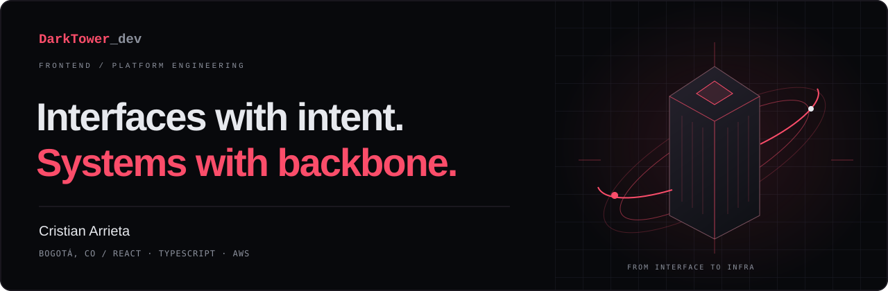

# Hey, I'm Cristian Arrieta.

**Senior Frontend Developer · Platform Engineer · Bogotá, Colombia**

I build the interfaces people use and the systems that keep them running. With **8+ years in web development**, my work spans React experiences, Next.js applications, mobile apps, and AWS infrastructure.

[**Explore my portfolio ↗**](https://portfolio.darktower.dev) · [LinkedIn](https://www.linkedin.com/in/cristian-andres-arrieta-gutierrez-74a496b5) · [Email](mailto:darktowerdev@gmail.com) · [CV](https://portfolio.darktower.dev/cv.pdf)

## From the interface to the infrastructure

At **Zoe Financial**, I work across frontend development and platform engineering:

- **Product:** build core platform features and custom backend-for-frontend services with Next.js and Node.js.
- **Platform:** own AWS infrastructure and provision resources through infrastructure as code with SST.
- **Developer experience:** modernize React applications, migrate to Turborepo, and build CI/CD pipelines.
- **People:** mentor frontend developers and help them find their footing in the codebase.

[More about my experience ↗](https://portfolio.darktower.dev/experience)

## Selected work

| Project | What I worked on | Technologies |
| :--- | :--- | :--- |
| **[Zoe Financial](https://my.zoefin.com/)** | A platform connecting people with financial advisors. | Next.js · TypeScript · Turborepo · AWS |
| **[Fauni](https://portfolio.darktower.dev/projects)** | A mobile app for exploring animal diversity in an ecological park. | React Native · Expo · TypeScript · Laravel |
| **[Coca-Cola en tu hogar](https://www.entuhogar.coca-cola.com.co/)** | A platform for delivering Coca-Cola products to homes. | Angular · GraphQL · Node.js · AWS Lambda |

These are projects from my professional portfolio. Explore the [project gallery](https://portfolio.darktower.dev/projects) for more.

## My working stack

**Interfaces** &nbsp; React · Next.js · TypeScript · React Native · Tailwind CSS  
**Services & data** &nbsp; Node.js · GraphQL · REST APIs · PostgreSQL · DynamoDB  
**Infrastructure & delivery** &nbsp; AWS · SST · Vercel · Turborepo · CI/CD

## Beyond the day job

This GitHub is also my workshop: [JavaScript games](https://github.com/Darktowers/bubbleshooter), [Elixir experiments](https://github.com/Darktowers/elixirProyect), and [the code behind my portfolio](https://github.com/Darktowers/rebrand-portfolio).

I like working across the boundary between what a product feels like and how it works underneath.

---

**Have something in mind? [Let's talk ↗](mailto:darktowerdev@gmail.com)**  
Spanish / English · Based in Bogotá, building for the web.
