<picture>
  <source media="(max-width: 600px) and (prefers-color-scheme: dark)" srcset="assets/hero-mobile-dark-v2.svg">
  <source media="(max-width: 600px)" srcset="assets/hero-mobile-light-v2.svg">
  <source media="(prefers-color-scheme: dark)" srcset="assets/hero-desktop-dark-v2.svg">
  
</picture>

# Hey, I'm Cristian.

I'm a frontend developer and platform engineer in **Bogotá, Colombia**. I've spent **8+ years building web apps**, mostly with React, Next.js, and TypeScript.

My work often goes beyond the UI: writing the service behind a feature, sorting out a deployment, or figuring out why an app is slow. I like being able to follow a problem through and fix it.

[Email me](mailto:darktowerdev@gmail.com) · [LinkedIn](https://www.linkedin.com/in/cristian-andres-arrieta-gutierrez-74a496b5) · [CV](https://portfolio.darktower.dev/cv.pdf)

## Where I can help

<picture>
  <source media="(max-width: 600px) and (prefers-color-scheme: dark)" srcset="assets/stack-mobile-dark-v2.svg">
  <source media="(max-width: 600px)" srcset="assets/stack-mobile-light-v2.svg">
  <source media="(prefers-color-scheme: dark)" srcset="assets/stack-desktop-dark-v2.svg">
  
</picture>

**Building the frontend.** React, Next.js, and TypeScript are my main tools. I've built product features, worked on performance, and developed for mobile with React Native—including custom MFA authentication.

**Looking after the platform.** At Zoe Financial, I own AWS infrastructure, use SST to manage it as code, and build services with Next.js and Node.js to support the frontend.

**Making development easier.** I've worked on React upgrades, Turborepo migrations, CI/CD pipelines, and moving applications from EC2 to Vercel. I care about making the next change easier for the team.

**Helping teammates get settled.** I mentor frontend developers and help them get comfortable with the codebase while we build features together.

## These days

I'm a **Senior Frontend Developer / Platform Engineer at Zoe Financial**. I joined as a frontend developer in February 2021 and moved into my current role in October 2024.

A few more tools I work with

- **Frontend:** React Native · Tailwind CSS · JavaScript
- **APIs:** Node.js · GraphQL · REST
- **Data:** PostgreSQL · DynamoDB · MySQL
- **Delivery:** AWS · SST · Vercel · Turborepo · CI/CD

## A little outside work

You'll also find [JavaScript games](https://github.com/Darktowers/bubbleshooter) and [Elixir experiments](https://github.com/Darktowers/elixirProyect) here.

---

Have a project in mind? [Send me a message.](mailto:darktowerdev@gmail.com)  
Spanish / English · [Portfolio](https://portfolio.darktower.dev)
