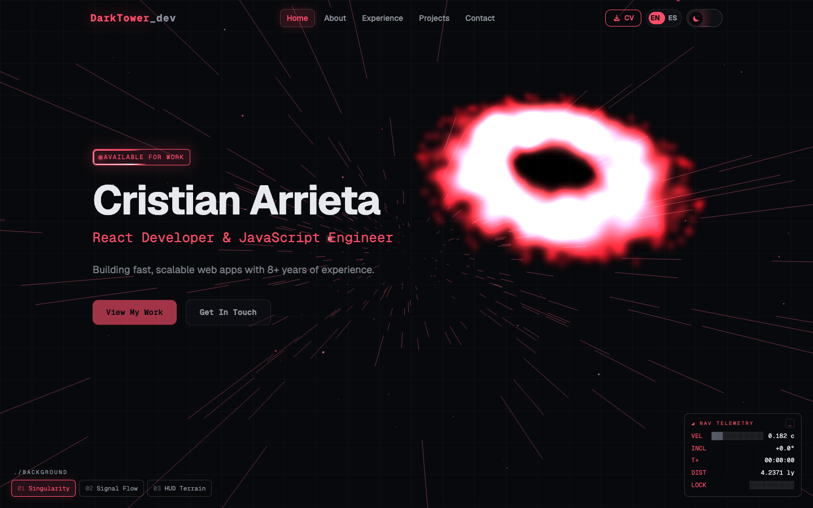
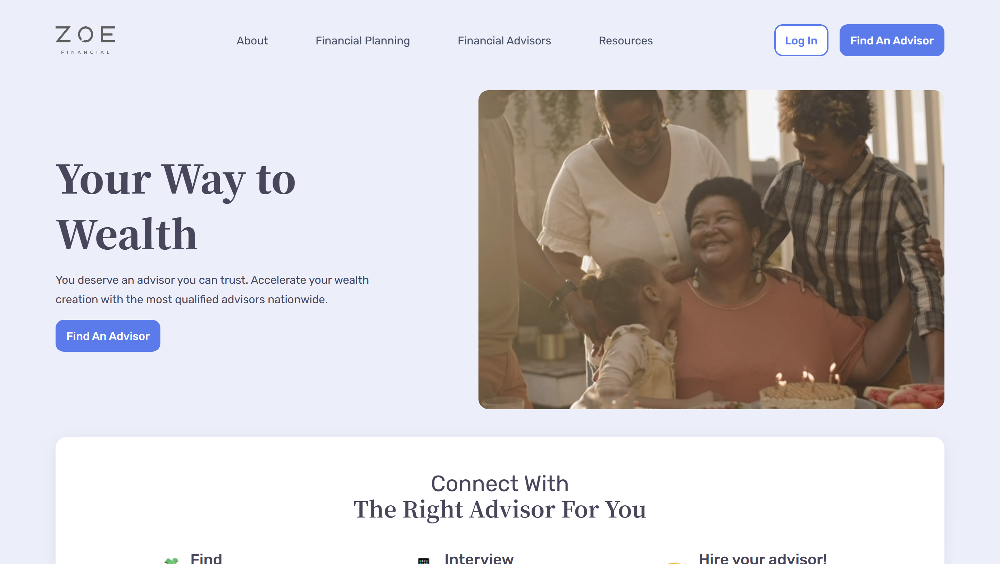
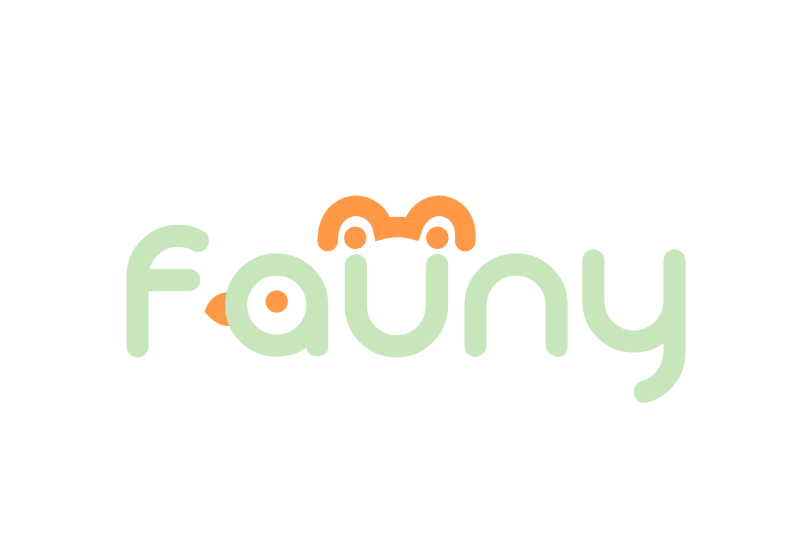
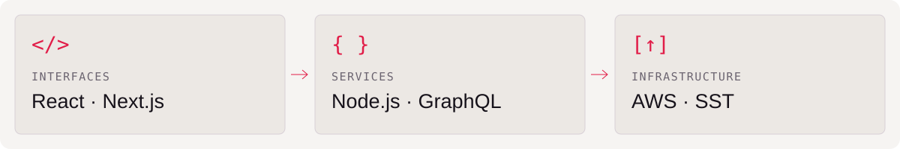

<a href="https://portfolio.darktower.dev">
<picture>
  <source media="(max-width: 600px) and (prefers-color-scheme: dark)" srcset="assets/hero-mobile-dark.svg">
  <source media="(max-width: 600px)" srcset="assets/hero-mobile-light.svg">
  <source media="(prefers-color-scheme: dark)" srcset="assets/hero-desktop-dark.svg">
  
</picture>
</a>

# Hey, I'm Cristian Arrieta.

**Senior Frontend Developer · Platform Engineer · Bogotá, Colombia**

I build the interfaces people use and the systems that keep them running. **8+ years** across React experiences, Next.js applications, mobile apps, and AWS infrastructure.

[**Explore my portfolio ↗**](https://portfolio.darktower.dev) · [LinkedIn](https://www.linkedin.com/in/cristian-andres-arrieta-gutierrez-74a496b5) · [Email](mailto:darktowerdev@gmail.com) · [CV](https://portfolio.darktower.dev/cv.pdf)

## Selected work

### DarkTower / My corner of the web

An interactive home for my work, with motion, themed interfaces, and a sci-fi visual identity.  
**Next.js · TypeScript · Motion** · [Explore ↗](https://portfolio.darktower.dev) · [Source code](https://github.com/Darktowers/rebrand-portfolio)

### Zoe Financial / Product meets platform

Frontend development and platform engineering for a financial-advisor platform. My work spans core features, backend-for-frontend services, AWS infrastructure, and developer experience.  
**Next.js · TypeScript · Turborepo · Node.js · AWS** · [Project ↗](https://my.zoefin.com/) · [My role](https://portfolio.darktower.dev/experience)

<strong>More work — Fauni &amp; Coca-Cola en tu hogar</strong>

### Fauni

A mobile app for exploring animal diversity in an ecological park.  
**React Native · Expo · TypeScript · Laravel**

### Coca-Cola en tu hogar

A platform for delivering Coca-Cola products to homes.  
**Angular · GraphQL · Node.js · AWS Lambda**

[View the project gallery ↗](https://portfolio.darktower.dev/projects)

## From interface to infrastructure

<picture>
  <source media="(max-width: 600px) and (prefers-color-scheme: dark)" srcset="assets/stack-mobile-dark.svg">
  <source media="(max-width: 600px)" srcset="assets/stack-mobile-light.svg">
  <source media="(prefers-color-scheme: dark)" srcset="assets/stack-desktop-dark.svg">
  
</picture>

**Also in the toolkit:** React Native · Tailwind CSS · REST APIs · PostgreSQL · DynamoDB · Vercel · Turborepo · CI/CD

<strong>Engineering background — what I do at Zoe Financial</strong>

- **Product:** build core platform features and custom backend-for-frontend services with Next.js and Node.js.
- **Platform:** own AWS infrastructure and provision resources through infrastructure as code with SST.
- **Developer experience:** modernize React applications, migrate to Turborepo, and build CI/CD pipelines.
- **People:** mentor frontend developers and help them find their footing in the codebase.

[More about my experience ↗](https://portfolio.darktower.dev/experience)

## Off the clock, still curious

My GitHub workshop includes [JavaScript games](https://github.com/Darktowers/bubbleshooter), [Elixir experiments](https://github.com/Darktowers/elixirProyect), and [the code behind my portfolio](https://github.com/Darktowers/rebrand-portfolio).

---

**Have something in mind? [Let's talk ↗](mailto:darktowerdev@gmail.com)**  
Spanish / English · Based in Bogotá, building for the web.
